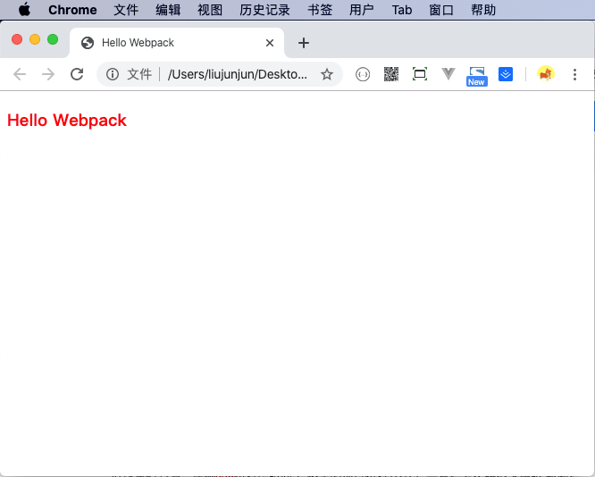
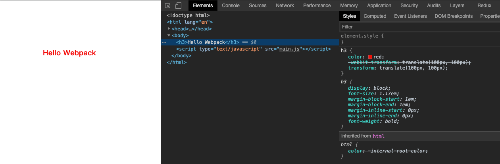
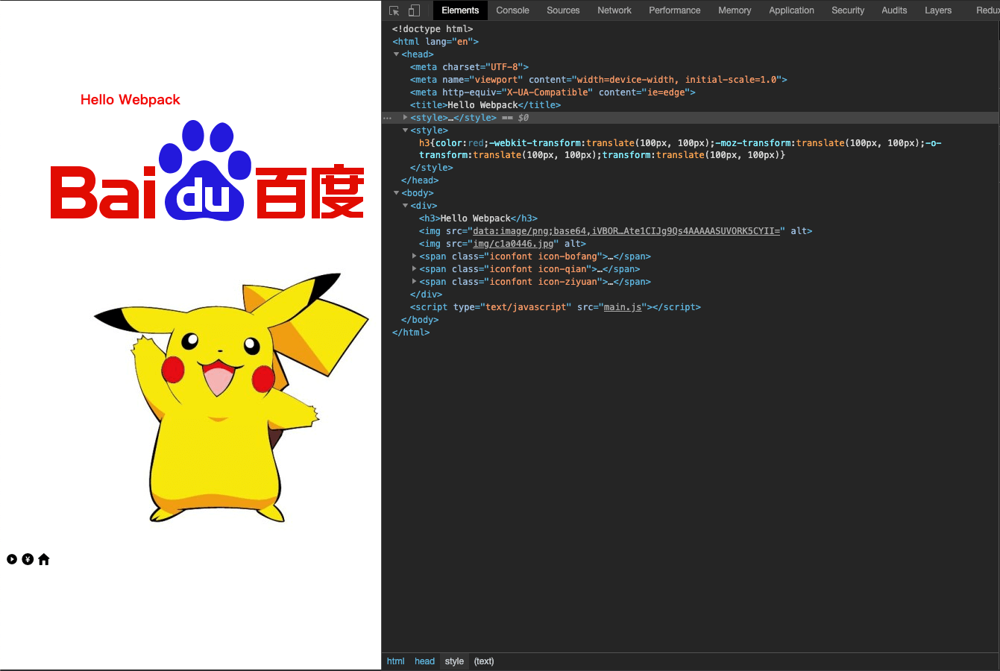
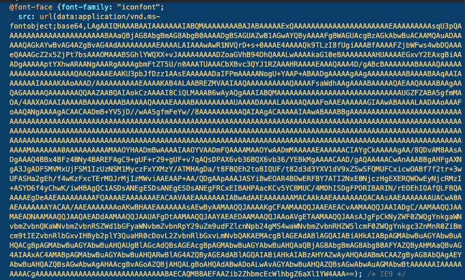

# 学习Webpack

## 1. 学习步骤

### 1. Hello Webpack

1. 新建目录，并初始化 `mkdir webpack-demo & npm init -y`

2. 安装 `webpack` ：`npm i webpack webpack-cli webpack-dev-server -D`

3. 新建配置文件 `config/webpack.config.js`

    ```
    module.exports = {
        entry: './src/index.js'
    }
    ```

4. 修改 `package.json` 文件

    ```
    "scripts": {
        "build": "webpack --config config/webpack.config.js"
    }
    ```

5. 新建 `src/index.js` ，输入任意JS代码

    ```
    console.log('Hello Webpack');
    ```
    
6. 执行 `npm run build`

    在当前目录，自动生成 `dist` 目录。内部包含一个 `main.js` 文件，可以看到被构建之后的代码。此时代码是被压缩的，后面通过配置，可以看到构建的源代码。


### 2. 解析 Vue 文件

1. 安装 `vue-loader` 和 `vue-template-compiler` ： `npm i vue-loader vue-template-compiler -D`

2. 修改配置 `config/webpack.config.js`

   ```
   const VueLoaderPlugin = require("vue-loader/lib/plugin");
   
   module.exports = {
       entry: './src/index.js',
       module: {
           rules: [
               {
                   test: /\.vue$/,
                   loader: 'vue-loader'
               }
           ]
       },
       plugins: [
           new VueLoaderPlugin()
       ]
   }
   ```

3. 新建 `src/app.vue`

   ```
   <template>
       <h3>Hello Webpack</h3>
   </template>
   ```

4. 修改 `src/index.js`

   ```
   // console.log('Hello Webpack');
   import App from './app.vue';
   
   console.log(App);
   ```

5. 执行 `npm run build`，查看 `dist` 目录的 `main.js`，能看到 `("h3",[this._v("Hello Webpack")])`等代码，表示 `vue` 文件解析成功。


留个练习，修改上面第三步，改为下列代码：

```
<template>
    <h3>Hello Webpack</h3>
</template>

<script>
export default {
    name: 'app'
}
</script>

<style>
h3 {
    color: red;
}
</style>
```

新增了 `style` 样式代码，重复执行 `npm run build`，会出现什么结果？


**答案是报错！！！**

原因很简单：目前我们还没有配置解析 `CSS` 的 `loader`。


### 3. 解析CSS

1. 安装CSS解析器：`npm i style-loader css-loader -D`

2. 修改配置，新增解析css规则

   ```
   {
   		test: /\.css$/,
   		use: ["style-loader", "css-loader"]
   }
   ```

3. 执行 `npm run build`，不会报错。

   查看 `dist` 目录，会看到类似 `(t=n(3)(!1)).push([e.i,"\nh3 {\n    color: red;\n}\n",""])` 的代码，表示解析CSS成功。


### 4. 在浏览器呈现我们的成果

1. 下载 `vue` : `npm i vue`

2. 下载 `html-webpack-plugin`： `npm i html-webpack-plugin -D`

3. 修改 `src/index.js`

   ```
   // console.log('Hello Webpack');
   import Vue from 'vue';
   import App from './app.vue';
   
   // console.log(App);
   new Vue({
       el: '#app',
       render: h => h(App)
   })
   ```

4. 新增 `public/index.html`

   ```
   <!DOCTYPE html>
   <html lang="en">
   
   <head>
       <meta charset="UTF-8">
       <meta name="viewport" content="width=device-width, initial-scale=1.0">
       <meta http-equiv="X-UA-Compatible" content="ie=edge">
       <title><%= htmlWebpackPlugin.options.title %></title>
   </head>
   
   <body>
       <div id="app"></div>
   </body>
   
   </html>
   ```

5. 修改 `config/webpack.config.js`

   ```
   const HtmlWebpackPlugin = require("html-webpack-plugin");
   
   module.exports = {
   		...
       plugins: [
           ...
           new HtmlWebpackPlugin({
               template: "./public/index.html",
               title: "Hello Webpack"
           })
       ]
       ...
   }
   ```

6. 执行 `npm run build`，此时不需要查看源码，直接将构建之后的 `index.html` 放在浏览器访问




### 5. CSS预处理器

使用CSS开发，还是刀耕火种的时代。太out了，我们借助于node & 预处理器，对CSS进行编程，让代码飞起来。

此处以 `sass` 为例，如果是 `less`  或者 `stylus`，则下载对应的 `loader`

1. 下载 `sass-loader`： `npm i sass-loader node-sass -D`

2. 修改配置 `config/webpack.config.js`

   ```
   {
   		// 注意此处由css改为scss
   		test: /\.scss$/,
   		use: ["style-loader", "css-loader", "sass-loader"]
   }
   ```

3. 修改 `src/app.vue` ，只修改 `style` 样式

   ```
   <style lang="scss">
   $color: red;
   h3 {
       color: $color;
   }
   </style>
   ```

4. 执行 `npm run build`，通过浏览器查看效果 `dist/index.html`，跟刚才效果一致。


### 6. 处理CSS衍生的问题

1. 下载 `postcss` ： `npm i postcss-loader postcss-preset-env -D `

2. 修改配置 `config/webpack.config.js`

   ```
   modules.exports = {
   		...
   		module: {
   				rules: [
   						...
   						{
                   test: /\.scss$/,
                   use: [
                       "style-loader",
                       "css-loader",
                       {
                           loader: "postcss-loader",
                           options: {
                               plugins: [require("postcss-preset-env")()]
                           }
                       },
                       "sass-loader"
                   ]
               }
               ...
   				]
   		}
   }
   ```

3. 根目录新增 `postcss.config.js`

   ```
   module.exports = {
       plugins: {
           "postcss-preset-env": {}
       }
   };
   ```

4. 根目录新增 `.browserslistrc` （默认支持下列浏览器）

   ```
   > 0.5%
   last 2 versions
   Firefox ESR
   not dead
   ```

5. 修改 `src/app.vue`

   ```
   <style lang="scss">
   $color: red;
   h3 {
       color: $color;
       transform: translate(100px, 100px);
   }
   </style>
   ```

6. 执行 `npm run build` ，从浏览器查看结果。

   

   可以看到：`transform` 自动增加了 `-webkit-`的前缀。

7. 更改 `.browserslistrc`

   ```
   > 0.01%
   last 7 versions
   Firefox ESR
   not dead
   ```

8. 再次执行 `npm run build` ，从浏览器查看效果

   

   可以看到：`transform` 自动增加了 `-webkit-`，`-o-`，`-moz-` 的前缀。


### 7. 处理静态资源（图片，字体，音视频等）

1. 下载 `url-loader` 和 `file-loader` ：`npm i file-loader url-loader -D`

2. 修改配置 `config/webpack.config.js`

   ```
   module.exports = {
   		module: {
   				rules: [
   						...
   						{
                   test: /\.(png|jpe?g|gif|svg)(\?.*)?$/,
                   use: [
                       {
                           loader: "url-loader",
                           options: {
                           		// 此处注意：需要配置为esModule，否则路径是对象格式
                               esModule: false,
                               limit: 8092,
                               name: "img/[hash:7].[ext]"
                           }
                       }
                   ]
               },
               {
                   test: /\.(mp4|webm|ogg|mp3|wav|flac|aac)(\?.*)?$/,
                   use: [
                       {
                           loader: "url-loader",
                           options: {
                           		// 此处注意：需要配置为esModule，否则路径是对象格式
                               esModule: false,
                               limit: 8092,
                               name: "media/[hash:7].[ext]"
                           }
                       }
                   ]
               },
               {
                   test: /\.(woff2?|eot|ttf|otf)(\?.*)?$/,
                   use: [
                       {
                           loader: "url-loader",
                           options: {
                           		// 此处注意：需要配置为esModule，否则路径是对象格式
                               esModule: false,
                               limit: 8092,
                               name: "font/[hash:7].[ext]"
                           }
                       }
                   ]
               }
   						...
   				]
   		}
   }
   ```

3. 查找图片字体资源，放在 `assets/images` 和 `assets/fonts` 目录下

4. 修改 `app.vue`

   引入图片资源：

   ```
   <template>
       <div>
           ...
           
   				
           ...
       </div>
   </template>
   ```

   

   引入字体：

   ```
   <template>
       <div>
           ...
           <span class="iconfont icon-bofang"></span>
           <span class="iconfont icon-qian"></span>
           <span class="iconfont icon-ziyuan"></span>
           ...
       </div>
   </template>
   
   <style lang="scss">
   @import './assets/fonts/iconfont.css';
   
   ...
   </style>
   ```

5. 执行 `npm run build` ， 在浏览器查看结果

   

   根据 `config/webpack.config.js` 的配置，如果图片大小小于 8092字节，则被 `url-loader` 转为 `base64`编码格式的图片。如果图片大小大于 8092字节，则被 `url-loader` 重命名 `/img/[hash:7].[ext]`。

   上图中，百度Logo是 7877 字节，皮卡丘是 20 kb，也就能解释上图现象

   

   

   字体的 `eot` 是2kb，也被转为 `base64` 格式。

   

## 2. 注意

1. 新建 `.gitignore` 文件，忽略相关文件或者目录

   ```
   node_modules
   dist
   *-lock.json
   ```
   


## 3. 问题

1. `package.json` 文件执行 `webpack` 命令为什么能成功，直接执行是否可以，执行流程是怎样的？
2. 为什么将 `node_modules` ， `dist`， `package-lock.json` 加入到 `.gitignore` 中？
3. `vue-loader` 和 `vue-template-compiler` 有什么作用？
4. `["style-loader", "css-loader"]` 什么作用，顺序能反吗？
5. `sass-loader` 和 `node-sass` 作用是什么？
6. 经常遇到`node-sass` 下载安装失败，有解决方法？
7. `url-loader` 和 `file-loader` 的区别？配置中为什么没有 `file-loader` 的配置？