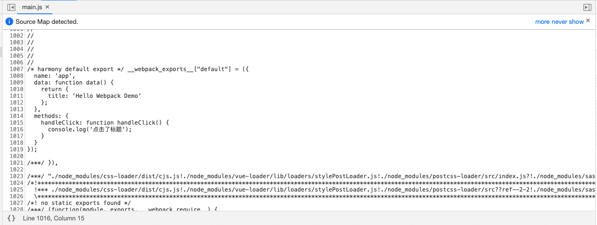
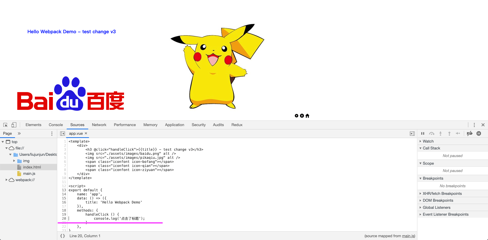
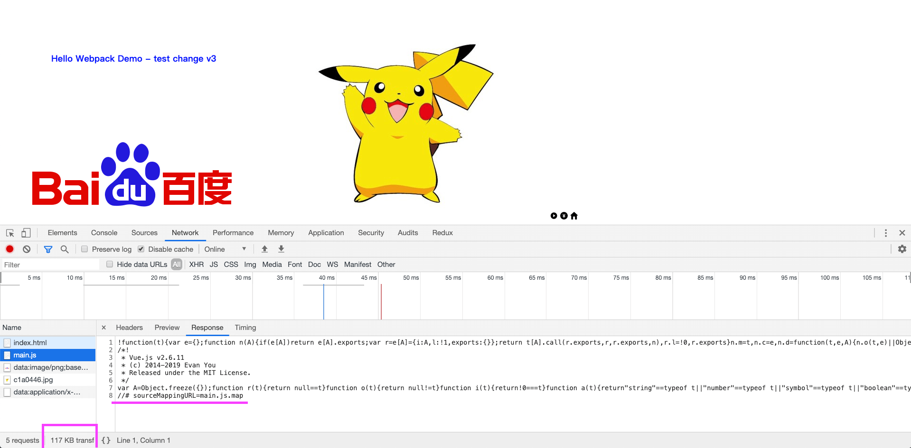
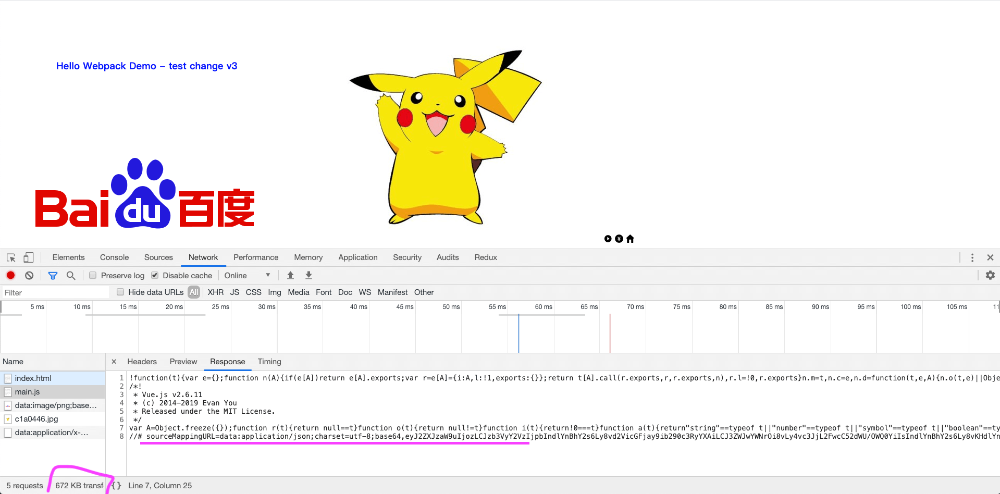
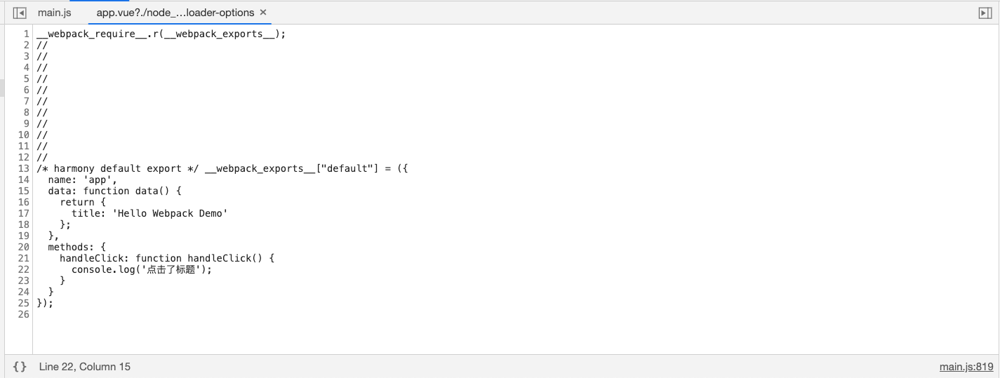
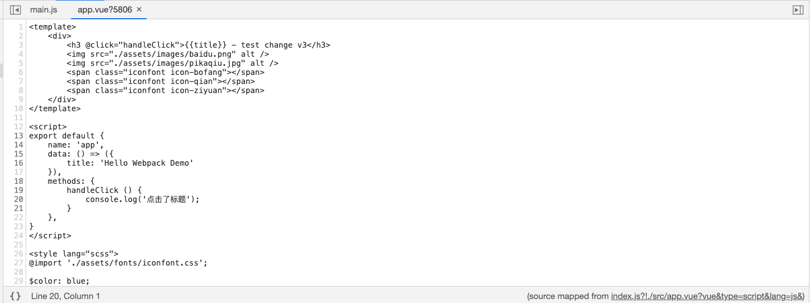

# 搭建本地开发环境

经过上一节的配置，已经可以着手开发项目，但是还有以下问题需要解决：

1. 手动执行构建。每次代码发生变动后，我们都需要手动执行一下构建命令。
2. 手动刷新浏览器。构建完成后，如果我们需要在页面中验证效果，需要手动刷新。
3. 无法精确定位错误。代码构建完成后，源代码被打包成一个 bundle，如果代码中出错，无法精确定位到出错代码的位置。


## 1. 自动构建

1. 下载：`npm i webpack-dev-server -D`

2. 修改配置 `config/webpack.config.js`

   ```
   module.exports = {
       ...
       devServer: {
           contentBase: path.join(__dirname, "dist")
       }
       ...
   }
   ```

3. 修改 `package.json`

   ```
   "scripts": {
     	"dev": "webpack-dev-server --open --config config/webpack.config.js"
   }
   ```

4. 执行 `npm run dev` ，默认开启 `8080` 端口，通过 `localhost:8080` 访问项目
5. 测试：修改 `app.vue` 的内容，会看到浏览器自动刷新


## 2. 模块热替换

能不能在页面改了个样式，不刷新，直接看效果呢？或者说，有一个N个字段的表单，修改了某处代码，之前输入的内容依然存在。

**程序员真是懒到极致了，太过分了**，不过这个需求，还是小case，能做到 - **模块热替换**

修改 `config/webpack.config.js` 文件配置就可以做到

```
module.exports = {
    ...
    devServer: {
    		hot: true,
        contentBase: path.join(__dirname, "dist")
    }
    ...
}
```


## 3. sourceMap

1. 修改 `src/app.vue`

   ```
   <template>
       <div>
    		<!-- 点击事件 -->
           <h3 @click="handleClick">{{title}} - test change v3</h3>
           
           
           <span class="iconfont icon-bofang"></span>
           <span class="iconfont icon-qian"></span>
           <span class="iconfont icon-ziyuan"></span>
       </div>
   </template>
   
   <script>
   export default {
       name: 'app',
       data: () => ({
           title: 'Hello Webpack Demo'
       }),
       methods: {
       		// 在控制台打印输出结果
           handleClick () {
               console.log('点击了标题');
           }
       },
   }
   </script>
   
   <style lang="scss">
   @import './assets/fonts/iconfont.css';
   
   $color: blue;
   h3 {
       color: $color;
       transform: translate(100px, 100px);
   }
   </style>
   ```
   
2. 修改配置 `config/webpack.config.js`

   ```
   module.exports = {
   		...
       devtool: 'eval-source-map',	// none, source-map, inline-source-map, eval, eval-source-map
       ...
   }
   ```

   下面，我们分别通过点击事件，测试这几个取值在浏览器控制栏输出的结果

   1. `devtool: none`

      

      不生成source map

   2. `devtool: source-map`

      

      映射到原始代码

   3. `devtool: inline-source-map`

      

      `source-map` 和 `inline-source-map` 在控制栏展示一致。那么实际区别是什么呢？再来看图

      

      

   通过比较可以得出结论：`inline-source-map` 最后的map内联在 `main.js`  ，而`source-map` 是独立的 `main.js.map` 文件。

   4. `devtool:eval ` 

      

   5. `devtool: eval-source-map`

      

   上面针对每个参数值进行了比较，现在放在一起比较下。

   | devtool           | 构建速度 | 重新构建速度 | 适用环境 | 精准度                                                       |
   | ----------------- | -------- | ------------ | -------- | ------------------------------------------------------------ |
   | none              | +++      | +++          | 生产环境 | 不生成source map                                             |
   | source-map        | --       | --           | 生产环境 | 映射到原始源代码，source map 作为单独的文件保存              |
   | inline-source-map | --       | --           | 开发环境 | 映射到原始源代码，source map 转换为 DataUrl 后添加到 bundle 中，会导致文件大小剧增。 |
   | eval              | +++      | +++          | 开发环境 | 映射到转换后的代码，而不是源代码，行数映射不正确。           |
   | eval-source-map   | --       | +            | 开发环境 | 映射到原始源代码，只映射到行。                               |

   根据以上信息我们可以得出基本的结论：

   - 生产环境中不生成 sourcemap，或者如果需要拥有错误上报工具，选择 source-map。
   - 开发环境中，根据对代码映射精确度的要求，可以选择 eval， eval-source-map，inline-source-map。

   我们在开发环境中需要兼顾构建速度，同时需要能映射到源代码查找问题，一般情况能定位到行的话，对于开发者就足够了。所以我们在开发环境中选择使用 eval-source-map。


# 问题

1. 模块热替换是这么实现的，所有在webpack中开发的代码，都可以实现热替换吗？

   

   