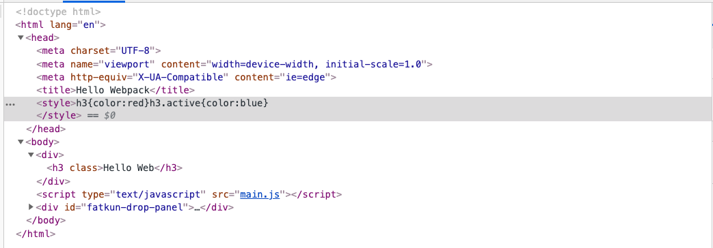
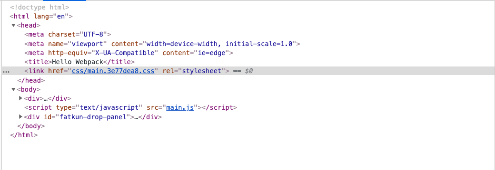

# Webpack优化

## 1. 配置CSS

上步骤在浏览器访问，如下图所示：



默认配置下，CSS是内嵌入html中的，这种方式的优点在于，浏览器下载html之后，css也同步下载下来，加速渲染。但缺点也很明显，css如果样式较大，下载较慢，影响网页渲染。

我们的目的很简单：将css通过link标签方式引入到html的head中。

1. 下载：`npm i mini-css-extract-plugin -D`

2. 修改 `config/webpack.config.base.js` ， 剪切关于 `scss` 的 `loader` 配置，复制到 `config/webpack.config.dev.js`

   ```
   const merge = require("webpack-merge");
   const webpackBaseConfig = require('./webpack.config.base');
   
   module.exports = merge(webpackBaseConfig, {
       mode: 'development',
       module: {
           rules: [
               {
                   test: /\.scss$/,
                   use: [
                       "style-loader",
                       "css-loader",
                       {
                           loader: "postcss-loader",
                           options: {
                               plugins: [require("postcss-preset-env")()]
                           }
                       },
                       "sass-loader"
                   ]
               },
           ]
       }
   });
   ```

   

3. 修改 `config/webpack.config.prod.js`

   ```
   const merge = require("webpack-merge");
   const webpackBaseConfig = require('./webpack.config.base');
   const { CleanWebpackPlugin } = require('clean-webpack-plugin');
   const MiniCssExtractPlugin = require("mini-css-extract-plugin");
   
   module.exports = merge(webpackBaseConfig, {
       mode: 'production',
       module: {
           rules: [
               {
                   test: /\.scss$/,
                   use: [
                       MiniCssExtractPlugin.loader,
                       'css-loader',
                       "sass-loader",
                       {
                           loader: "postcss-loader",
                           options: {
                               plugins: [require("postcss-preset-env")()]
                           }
                       }
                   ]
               }
           ]
       },
       plugins: [
           // 清理 dist 目录
           new CleanWebpackPlugin({
               filename: './dist'
           }),
           //提取 css
           new MiniCssExtractPlugin({
               // 类似 webpackOptions.output里面的配置
               filename: "css/[name].[chunkhash:8].css",
               chunkFilename: "css/[id].css"
           })
       ]
   });
   ```

4. 执行 `npm run build` ， 再执行 `npm run dist` ，在浏览器访问

   

   我们发现，css被独立文件，并通过 link 方式引入到 html 的 head 标签中。

